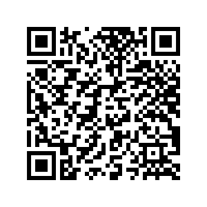
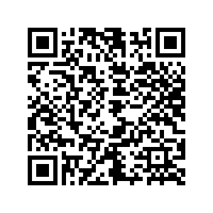

# NoSmoke
Proyecto AR con Unity + Vuforia para concienciar sobre el consumo de tabaco, con la colaboración de [Zahira Suárez](https://github.com/ZahiraSuarez).
Realizado como tareas introductorias de RA en el módulo de Realidad virtual y realidad aumentada del curso de especialización de Videojuegos y Realidad Virtual.

# Índice:
- [Descargas](#Descargas)
- [Código fuente](#Código)
- [Info](#Info)
- [Demos](#Demos)
- [Vídeos técnicos](#Técnico)

# Descargas
- Elige la versión que mejor se ajuste a tu teléfono [aquí](https://drive.google.com/drive/folders/11UqycwKOSRM4n5MuZM5q2KgRkU-zklb0?usp=sharing).
- También puedes utilizar estos QR para cada una:
- ARM7:
  

- ARM64:
  

# Código fuente
Debido a las limitaciones de espacio de GitHub, el código fuente reside en Google Drive en forma de .unitypackage.
Puede descargarlo [aquí](https://drive.google.com/drive/folders/1DO2Vrsq8HbsHCYTXZ5imVwWCBahq1Oek?usp=sharing).

# Info
## Tarea01
Esta tarea sirvió de introducción al desarrollo de experiencias de Vuforia en Unity. La aplicación resultante de esta tarea funciona con 3 imágenes distinas, mostrando una disposición de modelos y eslogan única para cada una.
Haga click [aquí]() para leer el documento del Producto Mínimo Viable.

## Tarea02
Esta tarea sirvió de continuación para la anterior. Aquí hicimos uso de Polycam para escanear un objeto del mundo real que una vez enfocado, enseñará modelos 3D alrededor de este objeto.
